<p align="center">
  
</p>

<p align="center">
  
</p>

<p align="center">
  <a href="https://joysarkar.netlify.app"></a>
  <a href="https://github.com/Joy185c"></a>
  <a href="https://www.behance.net/joysarkar42"></a>
</p>

<p align="center">
  
  
  
</p>


## About

I'm a **Computing and Information System (CIS) student at Daffodil International University (DIU)**, passionate about building intelligent, useful, and beautifully designed digital products.

With a background in graphic design and a growing focus on software engineering, I'm exploring the intersection of **Artificial Intelligence, Web Development, and Product Design**.

```js
const joy = {
  name: "Joy Sarkar (Yuv)",
  studying: "Computing and Information System @ DIU",
  roles: ["AI Engineer in the Making", "Full-Stack Developer", "UI/UX & Graphic Designer"],
  exploring: ["LLMs", "RAG", "AI Agents", "Model Routing", "SaaS"],
  achievement: "Student Services Winner · DIU AI Project Competition 2026",
  goal: "Build impactful AI-powered digital products",
};
```



## What I Do

<table>
  <tr>
    <td width="50%"></td>
    <td width="50%"></td>
  </tr>
  <tr>
    <td width="50%"></td>
    <td width="50%"></td>
  </tr>
</table>


## Tech Arsenal

<table>
  <tr>
    <td width="22%" valign="middle"><b>Frontend</b></td>
    <td></td>
  </tr>
  <tr>
    <td valign="middle"><b>Backend & Database</b></td>
    <td></td>
  </tr>
  <tr>
    <td valign="middle"><b>Languages</b></td>
    <td></td>
  </tr>
  <tr>
    <td valign="middle"><b>AI</b></td>
    <td>
      
      
      
    </td>
  </tr>
  <tr>
    <td valign="middle"><b>Design & Tools</b></td>
    <td></td>
  </tr>
</table>

<p align="center"><i>I'm continuously learning and improving. My proficiency varies across these tools and technologies.</i></p>


## Featured Projects

<table>
  <tr>
    <td width="50%"><a href="https://joysarkar.netlify.app"></a></td>
    <td width="50%"><a href="https://joysarkar.netlify.app"></a></td>
  </tr>
  <tr>
    <td width="50%"><a href="https://joysarkar.netlify.app"></a></td>
    <td width="50%"><a href="https://joysarkar.netlify.app"></a></td>
  </tr>
  <tr>
    <td width="50%"><a href="https://joysarkar.netlify.app"></a></td>
    <td width="50%"><a href="https://joysarkar.netlify.app"></a></td>
  </tr>
</table>

<p align="center">
  <a href="https://joysarkar.netlify.app"></a>
  <a href="https://github.com/Joy185c?tab=repositories"></a>
</p>


## GitHub Overview

<p align="center">
  
  
</p>

<p align="center">
  
</p>

<p align="center">
  
</p>

<p align="center"><i>GitHub statistics are rendered by external services and may occasionally be unavailable.</i></p>


## Currently Growing

- Strengthening programming fundamentals and problem-solving
- Building practical full-stack applications
- Exploring LLMs, RAG, AI agents, and intelligent workflows
- Learning software architecture, testing, and deployment
- Improving responsive UI/UX and product design
- Turning early-stage ideas into usable digital products

## Beyond Code

I enjoy participating in hackathons, collaborating with other developers, exploring emerging technologies, and transforming early-stage ideas into working prototypes.

My graphic design background influences how I approach software: I care about not only whether an application works, but also whether it feels intuitive, looks polished, and solves a meaningful problem.

> Great software solves problems. Great design makes solutions intuitive. Great engineering makes them reliable.


## Let's Connect

<p align="center">
  <a href="https://joysarkar.netlify.app"></a>
  <a href="https://github.com/Joy185c"></a>
  <a href="https://www.behance.net/joysarkar42"></a>
</p>

<p align="center">
  
</p>
